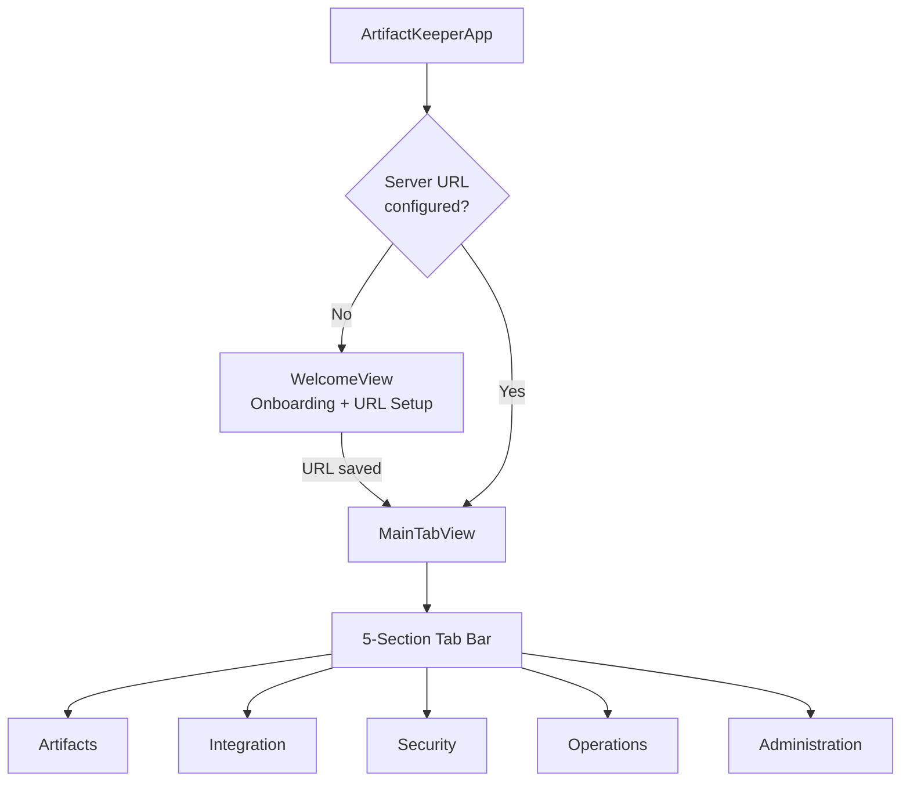
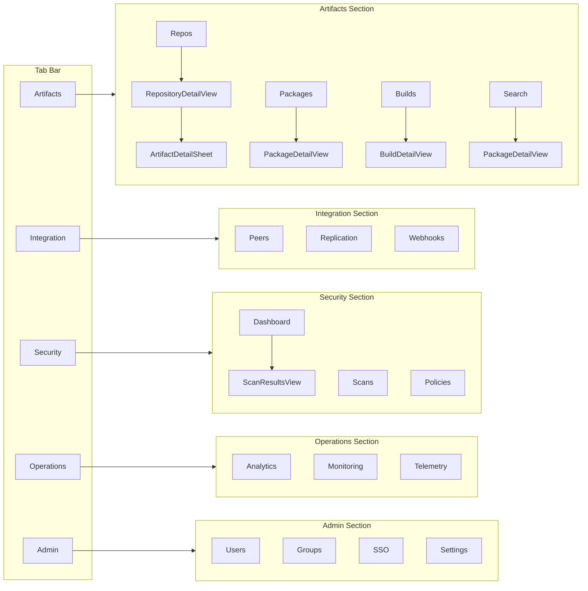
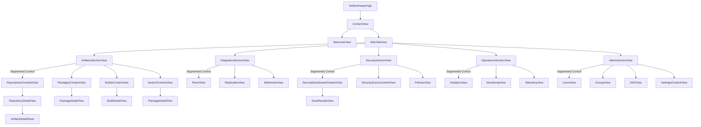
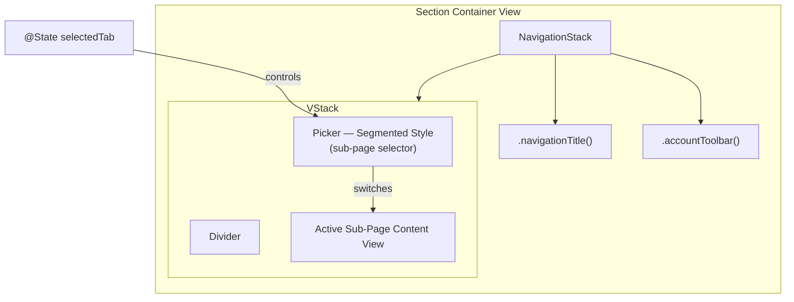
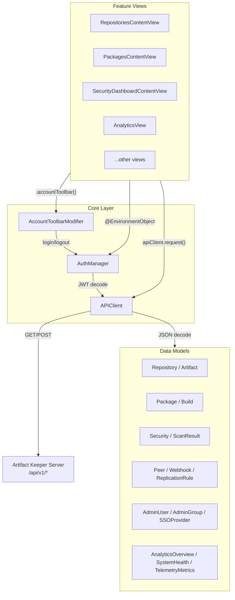
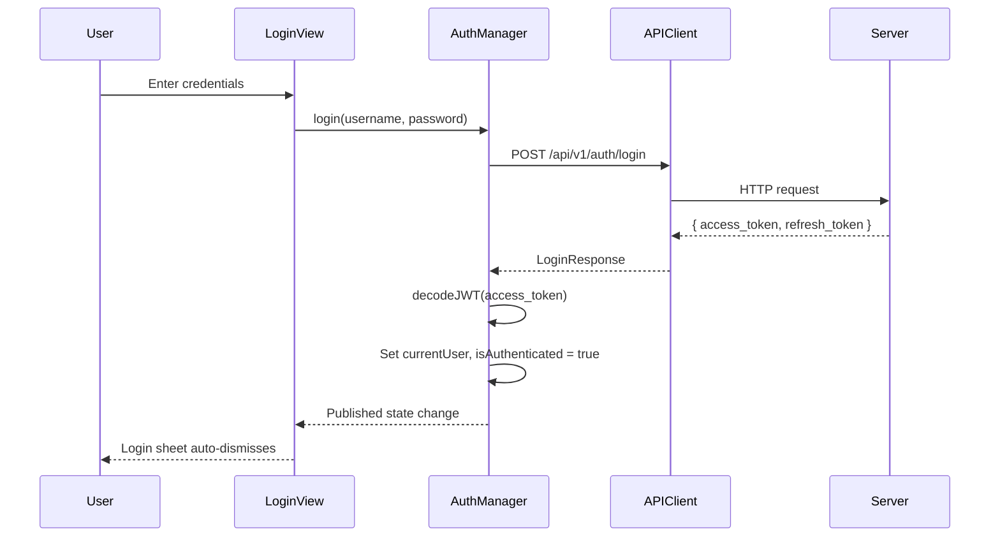
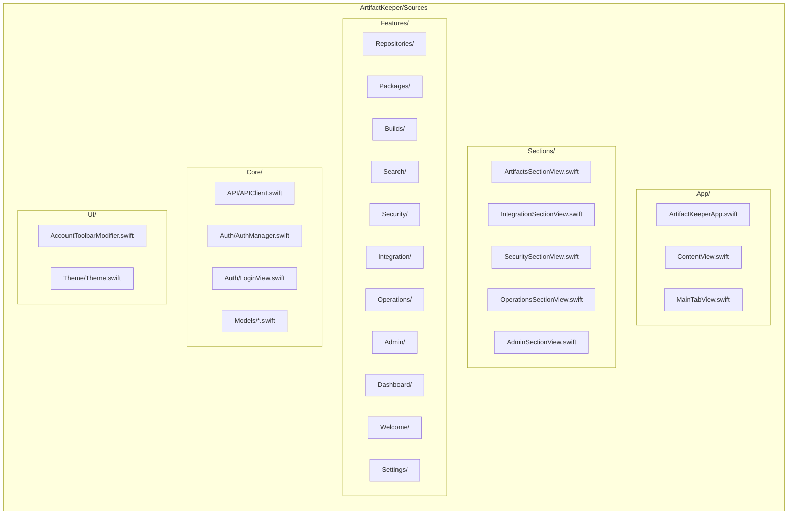

# Artifact Keeper — iOS / macOS

Native iOS and macOS app for Artifact Keeper, built with SwiftUI and targeting iOS 17+ / macOS 14+.

## Tech Stack

- **SwiftUI** with iOS 17+ / macOS 14+ APIs
- **Swift 6** with strict concurrency
- **Alamofire** for networking
- **Swift Dependencies** for dependency injection
- **Kingfisher** for image loading
- **xcodegen** for project generation

## Design

Follows Apple Human Interface Guidelines with:
- Native navigation patterns (NavigationStack, TabView)
- SF Symbols for iconography
- Dynamic Type support
- Dark/Light mode support
- Segmented controls for sub-navigation within sections

## Architecture

### App Launch Flow

### Navigation Structure

### View Hierarchy

### Section Pattern

Each section tab follows the same container pattern:

### Core Layer Architecture

### Authentication Flow

### API Communication

```mermaid
flowchart LR
    subgraph App["iOS / macOS App"]
        AC[APIClient]
    end

    subgraph Endpoints["Backend API Endpoints"]
        direction TB
        E1["GET /api/v1/repositories"]
        E2["GET /api/v1/packages"]
        E3["GET /api/v1/builds"]
        E4["GET /api/v1/security/scores"]
        E5["GET /api/v1/security/scans"]
        E6["GET /api/v1/peers"]
        E7["GET /api/v1/replication/rules"]
        E8["GET /api/v1/webhooks"]
        E9["GET /api/v1/analytics/overview"]
        E10["GET /api/v1/system/health"]
        E11["GET /api/v1/telemetry/metrics"]
        E12["GET /api/v1/admin/users"]
        E13["GET /api/v1/admin/groups"]
        E14["GET /api/v1/admin/sso/providers"]
        E15["POST /api/v1/auth/login"]
    end

    AC <-->|"JSON over HTTPS"| Endpoints
```

### File Structure

## Features

### Artifacts
- Repository browsing with search and filtering
- Artifact details with download links (opens in browser)
- Package list with version history
- Build tracking with status filtering (success/failed/running/pending)
- Full-text search across packages

### Integration
- Peer instance overview with sync status
- Replication rules monitoring
- Webhook configuration viewer

### Security
- Security score dashboard with grade badges (A-F)
- Vulnerability counts by severity (Critical/High/Medium/Low)
- Scan results with expandable details
- Security policy viewer

### Operations
- Analytics dashboard (downloads, uploads, storage, active repos)
- Top packages by download count
- System health monitoring (database, storage status)
- Disk usage with progress indicator
- Telemetry metrics (requests/min, error rate, latency, connections)

### Administration
- User management with role indicators
- Group management with member counts
- SSO provider configuration viewer
- Server URL management and account settings

## Getting Started

1. Install xcodegen: `brew install xcodegen`
2. Generate the Xcode project: `cd artifact-keeper-ios && xcodegen generate`
3. Open `ArtifactKeeper.xcodeproj` in Xcode 16+
4. Build and run for iOS Simulator, device, or macOS (universal app)

On first launch, enter your Artifact Keeper server URL (e.g. `http://localhost:30080` for local development).
